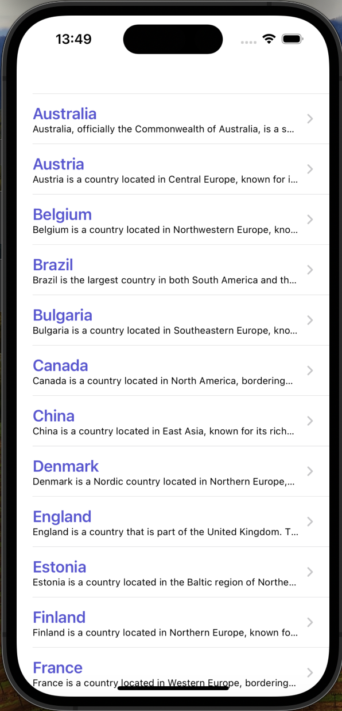
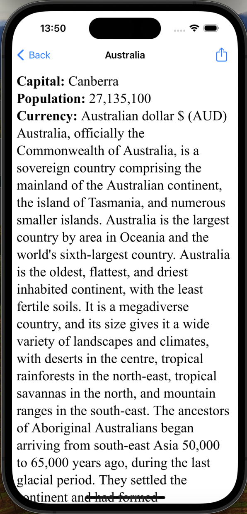

# CountriesFacts

CountriesFacts is a simple iOS app that displays information about countries from a JSON file.

## Table of Contents

* [Features](#features)
* [Screenshots](#screenshots)
* [Requirements](#requirements)
* [Usage](#usage)
* [Code Overview](#code-overview)

## Features

* Displays a list of countries from a JSON file
* Allows users to view the details of each country
* Includes a share feature to share the country's information

## Screenshots

  
   
  <em>Countries List Screen</em>

  
   
  <em>Country Details Screen</em>

## Requirements

* iOS 12.0+
* Xcode 12.0+
* Swift 5.0+

## Usage

1. Launch the app.
2. View the list of countries.
3. Tap on a country to view its details.
4. Share the country's information with others.

## Code Overview

### ViewController

* Manages the list of countries and displays them in a table view.
* Handles user interactions, such as selecting a country to view its details.
* Includes a feature to load the JSON file and parse its data.

### DetailViewController

* Displays the details of a selected country, including its name, capital, population, currency, and short description.
* Includes a share feature to share the country's information.

## Possible Improvements

* Add more features, such as filtering or sorting options for the countries list.
* Implement animations for loading the JSON file and displaying the country details.
* Add more details about each country, such as its flag or map.
* Improve the user interface design.
